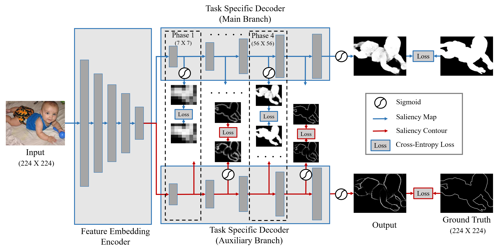
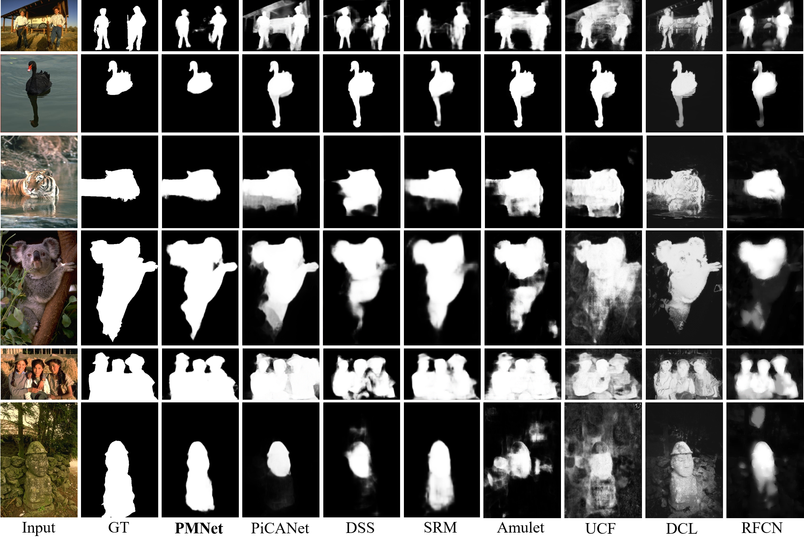
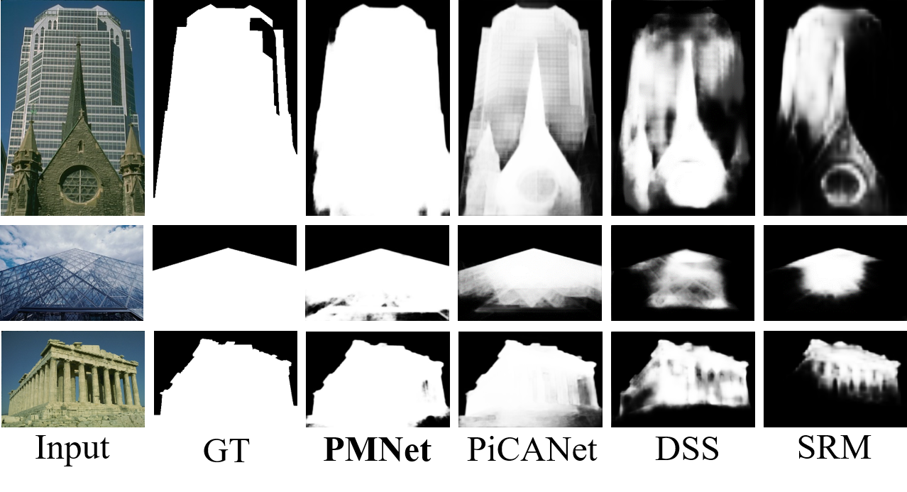
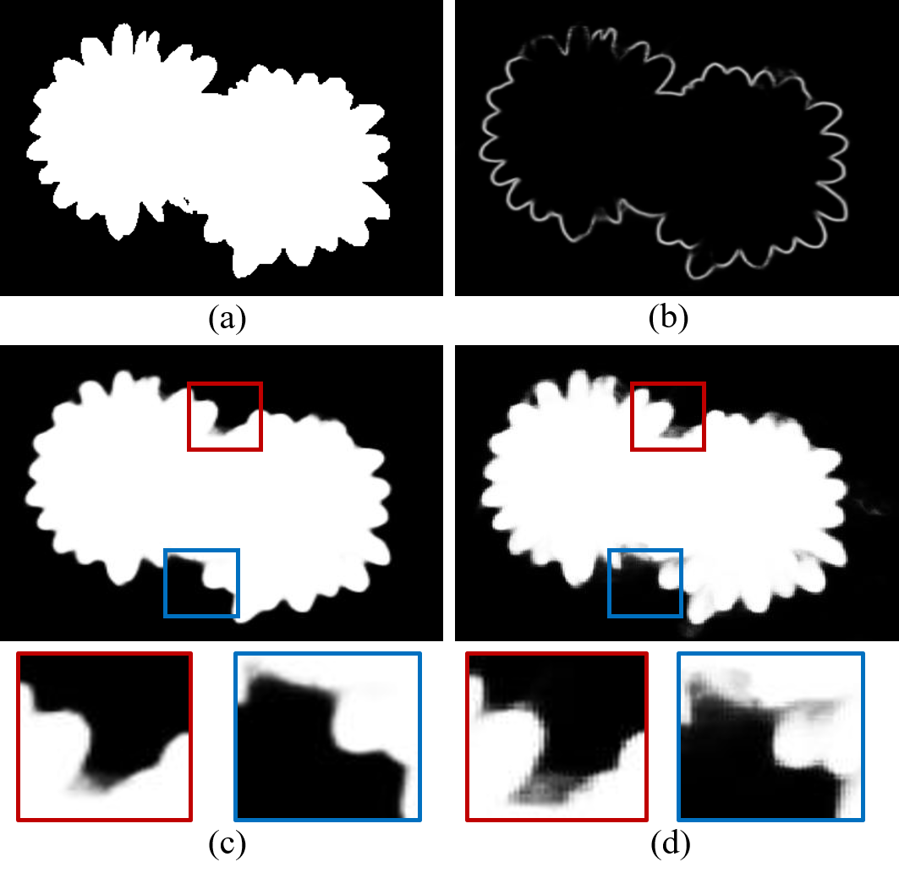
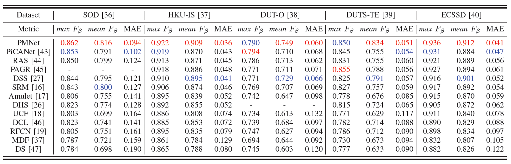
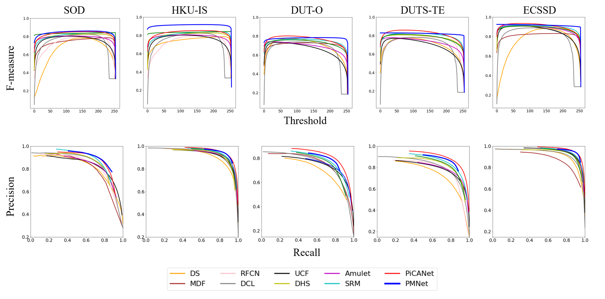

# PMNet: Coarse to Fine: Progressive and Multi-Task Learning for Salient Object Detection

Pytorch implementation of "Coarse to Fine: Progressive and Multi-Task Learning for Salient Object Detection"



### Qualitative Evaluation







### Quantative Evaluation





## Getting Started
### Installation

- Clone this repository
```
git clone https://github.com/tiruss/PMNet.git
```

- You can install all the dependencies by 
```
pip install -r requirements.txt
```

### Download datasets

- Download training datasets from the [link](https://drive.google.com/open?id=1U5d5dSj3yiB1vHhgoh94rbjBMRFjg5ld). DUTS-TR is our train dataset.

- Other datasets can download from the link [[sal_eval_toolbox]](https://github.com/ArcherFMY/sal_eval_toolbox) Thank you for the awesome evaluation toolbox!

### Run experiments from pretrained weight

- Download pretrained weight from the link. [[Google Drive]](https://drive.google.com/open?id=11PQySPgimyZ011FOjmxGBOGcyti1Z0rH) [[Baidu Drive]]() Baidu drive will be updated soon.

- If you want CRF for postprocessing, download [PyCRF](https://pypi.org/project/pydensecrf/) from the link.

- Run
```
python Test.py --weight [pretrained wieght] --input_dir [dataset name, default='DUTS-TE'] --crf [default='False']
```

- Pre-computed saliency maps can download from the link. [[Google Drive]](https://drive.google.com/open?id=1im9vBnMN5zLXH-NwHzsosltYyKfyRsyz) [[Baidu Drive]]() Baidu drive will be updated soon.

### Train from scratch

- DUTS-TR is our traning set for pair comparison

- First, you need make contour of dataset

```
python Make_Contour.py --data_dir [Dataset name ex)'DUTS-TR']
```

- Run 

```
python Train.py --img_dir [DUTS-TR img dir] --gt_dir [DUTS-TR label dir] --contour_dir [DUTS-TR contour dir] --epoch --batch_size --gpus --down_scale
```
